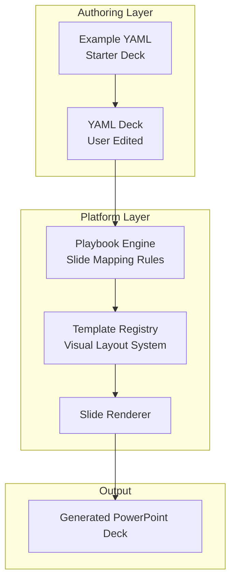

# Templates vs YAML Decks

Understanding the difference between **templates**, **playbooks**, and **YAML decks** is essential to using pptgen effectively.

Most users will only edit **YAML decks**. Templates and playbooks define the system that renders those decks into PowerPoint presentations.

---

# The Mental Model

pptgen separates **content**, **structure**, and **visual layout**.

```
Example YAML
      ↓
Deck YAML
      ↓
Playbook
      ↓
Template
      ↓
Generated PowerPoint
```

Each layer has a different responsibility.

| Layer | Purpose | Who edits it |
|------|------|------|
| Example YAML | Starting point for users | Users |
| Deck YAML | Defines presentation content | Users |
| Playbook | Maps YAML structure to slides | Platform maintainers |
| Template | Defines slide layouts and visual design | Platform maintainers |

---

# pptgen Rendering Architecture

The following diagram shows how pptgen transforms a YAML deck into a PowerPoint presentation.



Users typically interact only with **YAML decks and example decks**.  
Templates and playbooks define the system that renders those decks into presentations.

---

# YAML Decks (What Users Edit)

A **YAML deck** defines the **content of a presentation**.

This includes things like:

- title
- slides
- text
- bullet points
- tables
- metrics
- diagrams
- speaker notes

Example YAML deck:

```yaml
title: Architecture Review

slides:
  - type: title_slide
    title: Architecture Review
    subtitle: System Design Overview

  - type: bullet_slide
    title: Goals
    bullets:
      - Improve scalability
      - Reduce operational complexity
      - Standardize architecture patterns
```

Users typically create YAML decks by:

1. Copying an example
2. Editing the slide content
3. Running pptgen to generate a presentation

See:

- `docs/authoring/yaml_authoring_guide.md`
- `docs/authoring/slide_type_reference.md`

---

# Example Decks (Where Users Start)

Example decks are provided to help users get started quickly.

They demonstrate:

- common slide patterns
- best practices
- typical presentation structures

Examples can be found in:

```
docs/examples/
```

You should usually **copy an example and modify it** rather than starting from scratch.

Typical workflow:

```
1. Find an example
2. Copy it
3. Edit the YAML
4. Generate a presentation
```

---

# Playbooks (Internal Mapping Layer)

A **playbook** connects YAML slide definitions to specific template layouts.

It answers questions like:

- Which slide layout should be used?
- How should YAML fields map to slide elements?
- How should charts or tables be rendered?

Example responsibility of a playbook:

```
bullet_slide
    ↓
Template layout: "Title and Bullets"
```

Playbooks are part of the **platform implementation** and are usually maintained by developers.

Most users **do not edit playbooks**.

---

# Templates (Visual Design System)

A **template** defines the **visual appearance of slides**.

Templates include things like:

- slide layouts
- font styles
- colors
- spacing
- title placement
- chart styles
- brand design

Templates act like **PowerPoint themes or layout systems**.

Example template properties:

```
Template Name: Architecture Overview
Owner: Analytics Services
Lifecycle Status: approved
Latest Version: 1.0.0
```

Templates are registered in the system and visible in the **Templates UI**.

Most users **do not modify templates**.

Templates are typically maintained by platform maintainers or design teams.

---

# How These Pieces Work Together

When pptgen generates a presentation, the system processes the layers in order:

```
YAML Deck
    ↓
Playbook interprets slide types
    ↓
Template provides visual layout
    ↓
Slides are rendered
    ↓
PowerPoint file is produced
```

The YAML deck provides the **content**, while templates provide the **design**.

---

# What Users Should Edit

Most users only interact with:

```
YAML decks
Example decks
```

Typical user workflow:

```
1. Browse examples
2. Copy an example YAML deck
3. Edit the slide content
4. Generate the presentation
```

See:

- `docs/authoring/yaml_authoring_guide.md`
- `docs/authoring/slide_type_reference.md`

---

# What Users Should NOT Edit

In most cases, users should **not modify**:

```
templates/
playbooks/
template registry configuration
```

These are part of the platform's rendering system and are managed by maintainers.

---

# Choosing a Template

Templates define the **visual style** of a presentation.

Examples might include:

- Architecture overview
- Executive briefing
- Operations review
- Technical deep dive

Templates are selected by the system based on the deck configuration and playbook mapping.

You can inspect templates in the operator UI under:

```
Templates
```

---

# Summary

The key distinction is simple:

| Concept | Purpose |
|------|------|
| YAML deck | Defines presentation content |
| Example deck | Starting point for users |
| Playbook | Maps YAML to slide layouts |
| Template | Defines visual design |

If you are creating or editing a presentation, you should typically work with **YAML decks and examples**, not templates.
